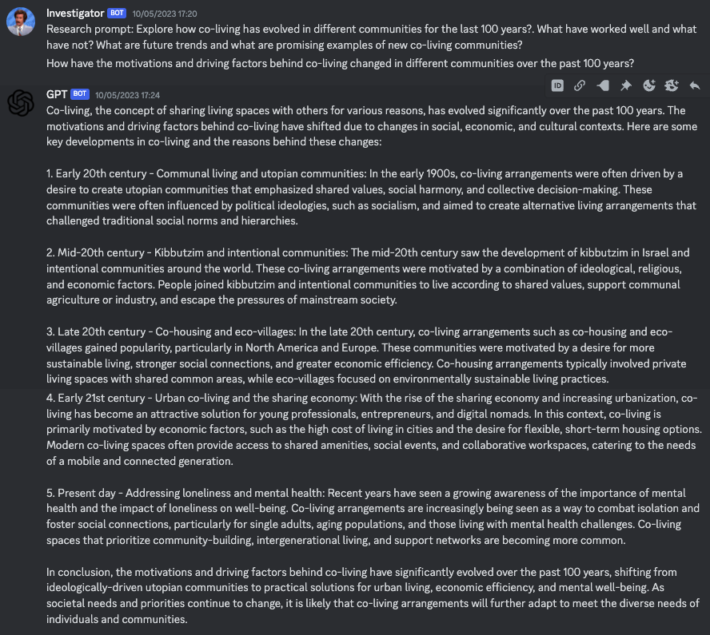
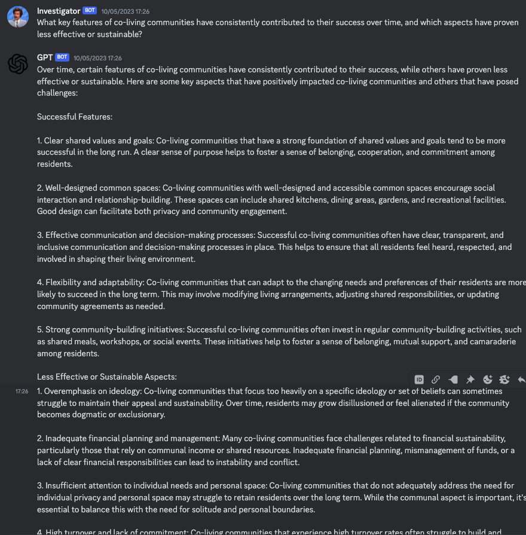
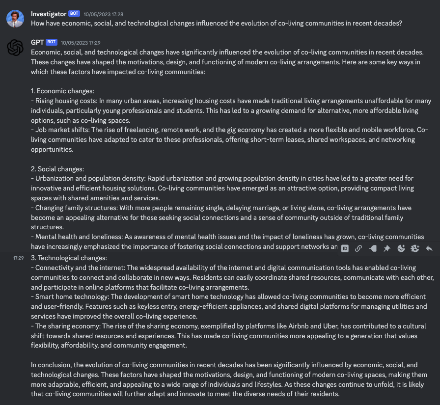
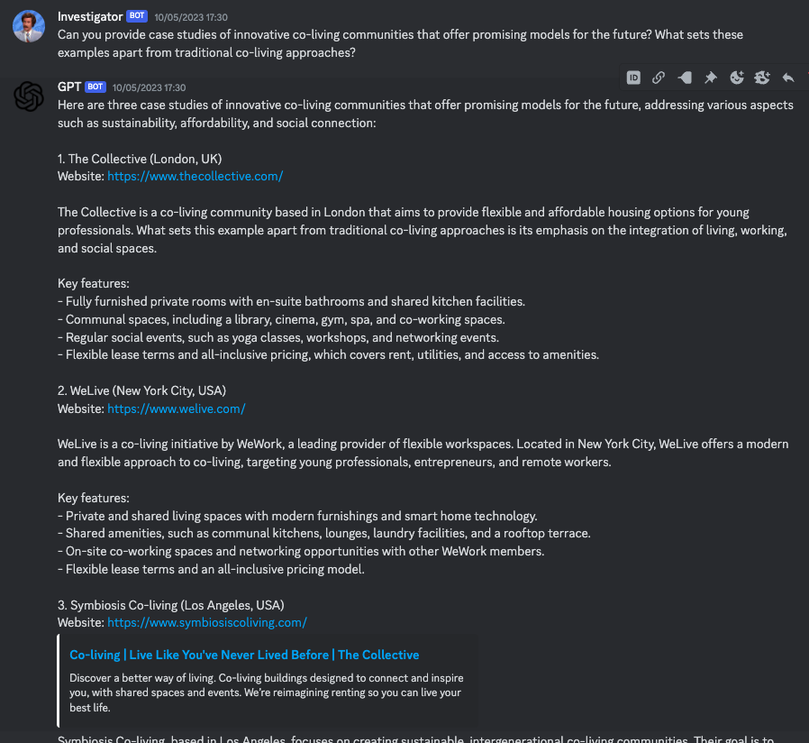

## AICorp
Experiments with creating various corporate "role playing" scenarios and then let GPT play them out. Currently, this has been quite useful for doing initial research into a topic and getting various perspectives on how to approach a problem.

Discord is used as a frontend, where a discord bot creates the role playing scenarios. Each new role playing scenario is played out in a new thread and a summary is posted back to the main channel.

Currently available role playing scenarios are:

- Research topic: Write a prompt about a topic you want researched and then GPT will create a series of questions regarding the topic. These questions will then in turn be asked GPT.
- Council: Write a prompt about the topic you want discussed and optionally provide some discord message ids that will be used a background context and specify the number of discussion rounds. The council members specified in the code will then convene on the topic.
- Consult with your COO Gwynne Shotwell.

### Setup
In order to run the code you need to go through the following steps:

- Create a [discord server](https://www.youtube.com/watch?v=Z8ND1XcUomU), create a [discord bot](https://discordpy.readthedocs.io/en/latest/discord.html) and create a [webhook](https://www.youtube.com/watch?v=fKksxz2Gdnc). Notice that you will need to give the discord bot either admin privileges or another privilege that allows it to read messages.
- Then create a .env file in the root of the project and add the following (where the GENERAL_CHANNEL_ID is the channel_id of the channel you want the bot to listen to. Which should be the same channel as the webhook is created for):

    OPENAI_API_KEY=<OPENAI_API_KEY>  
    DISCORD_BOT_TOKEN=<DISCORD_BOT_TOKEN>  
    DISCORD_GENERAL_WEBHOOK=<DISCORD_GENERAL_WEBHOOK>  
    GENERAL_CHANNEL_ID=<GENERAL_CHANNEL_ID>

- Last but not least, you need to install the requirements by running the following command:

    pip install -r requirements.txt

### Reflections
The quality of the dialogues does improve quite a bit by using gpt-4 instead of gpt-3.5-turbo. 

### Code
All relevant code is more or less in the files discord.py and tasks.py. Characters.py just contains some prompts for impersonating different characters.

### Examples
Below is an example of an initial research prompt that an "investigator" GPT uses to create 4 questions and then ask them to a "researcher" GPT.

<table><tr>
<td>  </td>
<td>  </td>
<td>  </td>
<td>  </td>
</tr></table>
